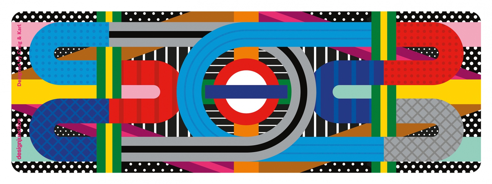

<div align="center">



&nbsp;


[](https://https://ruby-lang.org/)


</div>

### Install

To install:
``` bash
% git clone https://github.com/arthurfincham/oyster_card
```

### Usage

This program is designed to be run in IRB, Ruby's native REPL.

To start IRB and require the file in one go, navigate to the project's directory. Then run: 
``` bash
% irb -Ilib -roystercard
 ```

Begin by creating your own oystercard:
``` bash
> card = Oystercard.new
```
and you're good to go!

### Commmands

``` ruby
> card.top_up(10) # add £10 to your balance
```

``` ruby
> card.touch_in('Liverpool Street') # touch in at Liverpool Street
```

``` ruby
> card.touch_out('Victoria') # touch out at Victoria
```

``` ruby
> card.journey_history # return a list of past journeys
```

### Rules

- Your card must have enough money to touch in.
- If you fail to touch in/out *at a station*, you will charged a penalty fare.